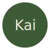

<!-- Improved compatibility of back to top link: See: https://github.com/othneildrew/Best-README-Template/pull/73 -->
<a id="readme-top"></a>
<!--
*** Thanks for checking out the Best-README-Template. If you have a suggestion
*** that would make this better, please fork the repo and create a pull request
*** or simply open an issue with the tag "enhancement".
*** Don't forget to give the project a star!
*** Thanks again! Now go create something AMAZING! :D
-->


<!-- PROJECT SHIELDS -->
<!--
*** I'm using markdown "reference style" links for readability.
*** Reference links are enclosed in brackets [ ] instead of parentheses ( ).
*** See the bottom of this document for the declaration of the reference variables
*** for contributors-url, forks-url, etc. This is an optional, concise syntax you may use.
*** https://www.markdownguide.org/basic-syntax/#reference-style-links
-->
[![Contributors][contributors-shield]][contributors-url]
[![Forks][forks-shield]][forks-url]
[![Stargazers][stars-shield]][stars-url]
[![Issues][issues-shield]][issues-url]
[![GNU GPLv3][license-shield]][license-url]
[![LinkedIn][linkedin-shield]][linkedin-url]


<!-- PROJECT LOGO -->
<br />
<div align="center">
  <a href="https://github.com/devalexwhite/Kai">
	
  </a>

<h3 align="center">Kai</h3>

  <p align="center">
	Free platform for organizing groups, meetups and events.
	<br />
	<a href="https://github.com/devalexwhite/Kai"><strong>Explore the docs »</strong></a>
	<br />
	<br />
	<a href="https://kaimeet.com">Website</a>
	&middot;
	<a href="https://github.com/devalexwhite/Kai/issues/new?labels=bug&template=bug-report---.md">Report Bug</a>
	&middot;
	<a href="https://github.com/devalexwhite/Kai/issues/new?labels=enhancement&template=feature-request---.md">Request Feature</a>
  </p>
</div>


<!-- TABLE OF CONTENTS -->
<details>
  <summary>Table of Contents</summary>
  <ol>
	<li>
	  <a href="#about-the-project">About The Project</a>
	  <ul>
		<li><a href="#built-with">Built With</a></li>
	  </ul>
	</li>
	<li>
	  <a href="#getting-started">Getting Started</a>
	  <ul>
		<li><a href="#prerequisites">Prerequisites</a></li>
		<li><a href="#installation">Installation</a></li>
	  </ul>
	</li>
	<!-- <li><a href="#usage">Usage</a></li> -->
	<li><a href="#roadmap">Roadmap</a></li>
	<li><a href="#contributing">Contributing</a></li>
	<li><a href="#license">License</a></li>
	<li><a href="#contact">Contact</a></li>
	<!-- <li><a href="#acknowledgments">Acknowledgments</a></li> -->
  </ol>
</details>


<!-- ABOUT THE PROJECT -->
## About The Project

[![Kai Screen Shot][product-screenshot]](https://kaimeet.com)

Kai is an open-source, free to use platform for hosting your community groups, meetups and events. Kai is designed to be the home for community groups, reducing the friction of starting a group. 

Kai was created to provide a free alternative to services that cost hundreds of dollars a year just to host meetups.

Currently, Kai supports the following features:

- Create and join groups in your city
- Create and RSVP to events
- Follow groups via RSS to keep updated on new events
- Communicate with groups members via the discussions board
- Download iCal files to remind yourself of events
- Discover upcoming groups to join

<p align="right">(<a href="#readme-top">back to top</a>)</p>


### Built With

* [![HTMX][HTMX]][HTMX-url]
* [![Slim Framework][Slim]][Slim-url]

<p align="right">(<a href="#readme-top">back to top</a>)</p>

### Deployment Status

[](https://forge.laravel.com/alex-white-kok/toybox/3078619)

<p align="right">(<a href="#readme-top">back to top</a>)</p>

<!-- GETTING STARTED -->
## Getting Started

DDEV is the fastest way to get up and running with Kai development.

### Prerequisites

This is an example of how to list things you need to use the software and how to install them.
* ddev
  ```sh
  brew install orbstack docker
  brew install ddev/ddev/ddev
  mkcert -install
  ```

### Installation

1. Clone the repo
   ```sh
   git clone https://github.com/devalexwhite/Kai.git
   ```
2. Start ddev
   ```sh
   cd kai
   ddev start
   ```
3. Visit the local URL `https://kai.ddev.site/`

<p align="right">(<a href="#readme-top">back to top</a>)</p>


<!-- USAGE EXAMPLES -->
<!-- ## Usage

Use this space to show useful examples of how a project can be used. Additional screenshots, code examples and demos work well in this space. You may also link to more resources.

_For more examples, please refer to the [Documentation](https://example.com)_

<p align="right">(<a href="#readme-top">back to top</a>)</p> -->


<!-- ROADMAP -->
## Roadmap

- [ ] Email service integration for event and RSVP notifications
- [ ] Event RSVP limits
- [ ] Closed groups that require approval to join
- [ ] Customizable group pages

See the [open issues](https://github.com/devalexwhite/Kai/issues) for a full list of proposed features (and known issues).

<p align="right">(<a href="#readme-top">back to top</a>)</p>


<!-- CONTRIBUTING -->
## Contributing

Contributions are what make the open source community such an amazing place to learn, inspire, and create. Any contributions you make are **greatly appreciated**.

If you have a suggestion that would make this better, please fork the repo and create a pull request. You can also simply open an issue with the tag "enhancement".
Don't forget to give the project a star! Thanks again!

1. Fork the Project
2. Create your Feature Branch (`git checkout -b feature/AmazingFeature`)
3. Commit your Changes (`git commit -m 'Add some AmazingFeature'`)
4. Push to the Branch (`git push origin feature/AmazingFeature`)
5. Open a Pull Request

<p align="right">(<a href="#readme-top">back to top</a>)</p>

### Top contributors:

<a href="https://github.com/devalexwhite/Kai/graphs/contributors">
  
</a>


<!-- LICENSE -->
## License

Distributed under the GNU GPLv3. See `LICENSE.txt` for more information.

<p align="right">(<a href="#readme-top">back to top</a>)</p>


<!-- CONTACT -->
## Contact

Alex White - [@alextheuxguy](https://fosstodon.org/@alextheuxguy) - hi@thatalexguy.dev

Project Link: [https://github.com/devalexwhite/Kai](https://github.com/devalexwhite/Kai)

<p align="right">(<a href="#readme-top">back to top</a>)</p>


<!-- ACKNOWLEDGMENTS -->
<!-- ## Acknowledgments

* []()
* []()
* []()

<p align="right">(<a href="#readme-top">back to top</a>)</p> -->


<!-- MARKDOWN LINKS & IMAGES -->
<!-- https://www.markdownguide.org/basic-syntax/#reference-style-links -->
[contributors-shield]: https://img.shields.io/github/contributors/devalexwhite/Kai.svg?style=for-the-badge
[contributors-url]: https://github.com/devalexwhite/Kai/graphs/contributors
[forks-shield]: https://img.shields.io/github/forks/devalexwhite/Kai.svg?style=for-the-badge
[forks-url]: https://github.com/devalexwhite/Kai/network/members
[stars-shield]: https://img.shields.io/github/stars/devalexwhite/Kai.svg?style=for-the-badge
[stars-url]: https://github.com/devalexwhite/Kai/stargazers
[issues-shield]: https://img.shields.io/github/issues/devalexwhite/Kai.svg?style=for-the-badge
[issues-url]: https://github.com/devalexwhite/Kai/issues
[license-shield]: https://img.shields.io/github/license/devalexwhite/Kai.svg?style=for-the-badge
[license-url]: https://github.com/devalexwhite/Kai/blob/master/LICENSE.txt
[linkedin-shield]: https://img.shields.io/badge/-LinkedIn-black.svg?style=for-the-badge&logo=linkedin&colorB=555
[linkedin-url]: https://linkedin.com/in/devalexwhite
[product-screenshot]: screenshots/dashboard.png
<!-- Shields.io badges. You can a comprehensive list with many more badges at: https://github.com/inttter/md-badges -->
[HTMX]: https://img.shields.io/badge/htmx-4A71D0?style=for-the-badge&logo=htmx&logoColor=white
[HTMX-url]: https://htmx.org
[Slim]: https://img.shields.io/badge/slim-7B9D4D?style=for-the-badge&logo=slim&logoColor=white
[Slim-url]: https://www.slimframework.com
